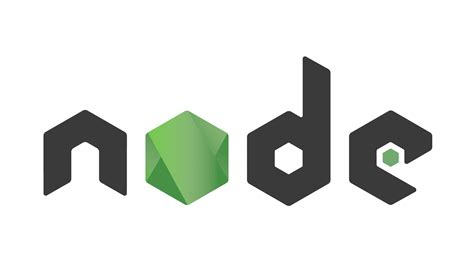

### Hey there 👋

## 

I am Prashil, a self-driven tech enthusiast, developer 

- 🏫 Computer Science student @Patan Multiple Campus (PMC)
- 📚 Currently studying REACT.js
- ✍️ 2021 Goals: Build more projects

### Skills

 

### Tools

 

### Connect with Me:

[][twitter]
[][linkedin]
[][instagram]

 

[website]: https://theprashil.github.io/
[twitter]: https://twitter.com/ickl0cc
[instagram]: #
[linkedin]: #
